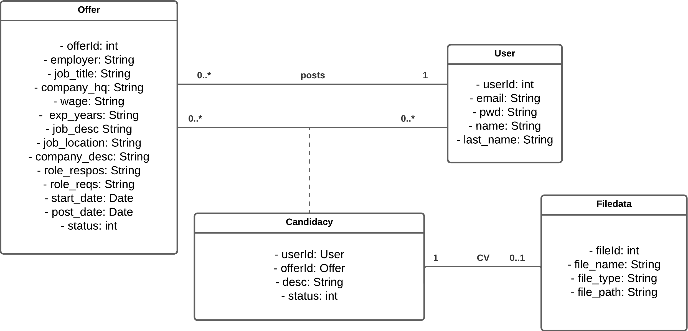
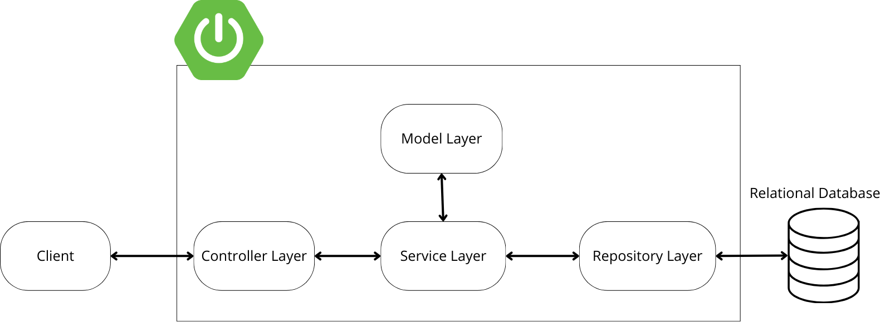

# Recruitment platform
This is a simple project for a web platform that allows recruiters to submit job offers, and for candidates to have access to and apply for job positions. 

**Frameworks used:**
- <span> Backend: Spring Boot 3.2.4  , Maven , Java 17  </san>
- <span> Frontend: Angular 16.1.2 </span>

<span> **Server:** Apache web server </span>

<span> **Database:** PostgreSQL </span>

**IDEs:**
-  Eclipse

-  VSCode

## Diagrams

* Class Diagram:



* Global architecture:


## Content

- [0. Backend application](#0-setup-backend-application)
    - [1. Setup the backend application](#1-setup-the-backend-application)
    - [2. MVC design pattern](#2-mvc-design-pattern)
- [1. Database connexion & configuration](#1-database-connexion--configuration)
- [2. Frontend application](#2-setup-frontend-application)

## 0. Backend application

### 1. Setup the backend application

We set up the backend project using [Spring Initializr](https://start.spring.io/), as a Maven project, and Java for the language. 

Add Maven dependencies:
- **Spring Web:** to build our RESTful application using Spring MVC, for a Model-View-Controller design pattern.
- **Spring Data JPA:** to persist data into our database.
- **PostgreSQL Driver:** to allow our Java application to connect to the PostgreSQL database. 

The application will be responding on port 8080.

### 2. MVC design pattern

Each entity of our class diagram will have a number of specific classes and interfaces dedicated to it organised in layers:

- **Model:** represents a data entity.
- **Repository or DAO(Data Access Object):** defines the contract for accessing and manipulating entities in the database.
- **Service Interface:** defines the contract for interacting with entities using CRUD operations and other business logic related to the entity.
- **Service Implementation:** implements the service interface.
- **Controller:** handles HTTP requests related to the entity.



Class diagram of the MVC design pattern for an entity:


## 1. Database connexion & configuration

### Setup the database

Create a new Database from pgAdmin.

### Configure connexion to the database

```
spring.datasource.url=jdbc:postgresql://localhost:5432/DATABASE_NAME
spring.datasource.username=USERNAME
spring.datasource.password=PASSWORD
spring.jpa.hibernate.ddl-auto=update
spring.datasource.driver-class-name=org.postgresql.Driver
```

## 2. Frontend application

1. Create an Angular project:

``` 
ng new project-name 
```

2. You can run the project using the command:

```
ng serve
```

3. The application will be running on port 4200. To view its interface, simply access the URL: http://localhost:4200

## Testing the code
To test out the code yourself:
1. Clone the project
``` 
git clone https://github.com/Cristal32/recruitment_platform.git 
